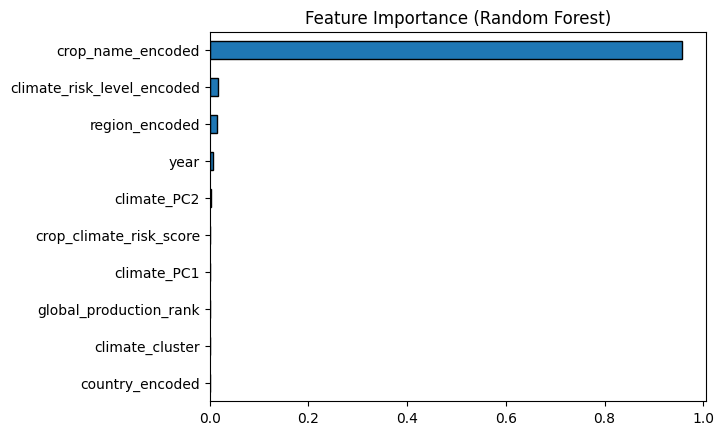
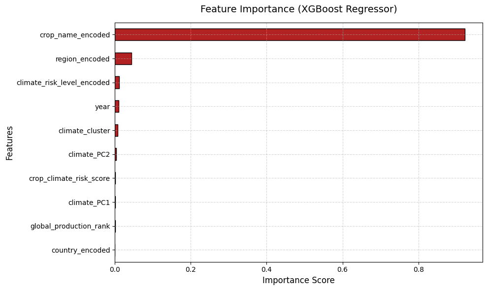
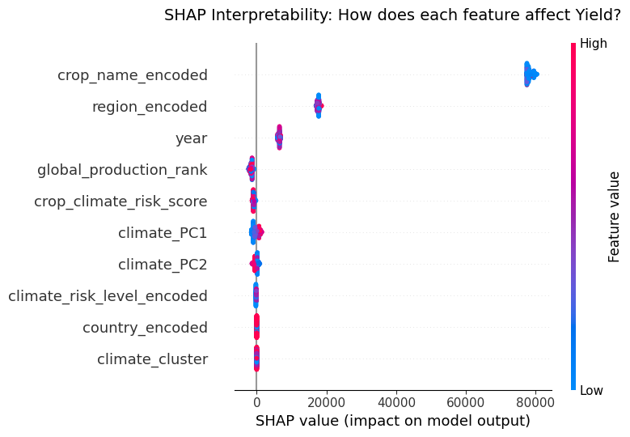
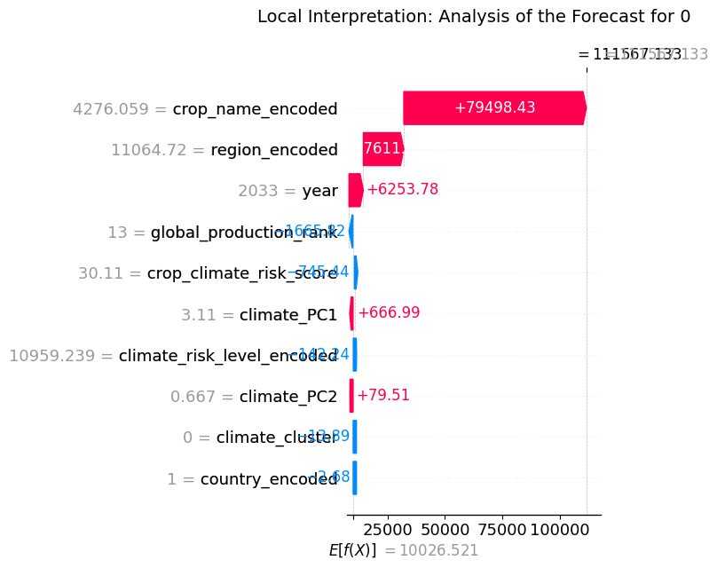

# 🌾 Global Crop Yield Forecasting & End-to-End ML Pipeline


An end-to-end Machine Learning pipeline designed to forecast global agricultural crop yields (`yield_kg_per_hectare`) across historical records and future projections (1961–2050).

This project focuses on **leakage-free feature engineering**, **dimensionality reduction for micro-climate factors**, **temporal train/test splitting**, and **Explainable AI (XAI)** using SHAP values.

---

## ⚠️ Dataset Disclaimer & Provenance

> **Note on Synthetic Data:** Key environmental and dynamic feature sets in this Kaggle dataset are synthetically generated. While the achieved metrics ($R^2 \approx 0.985$) demonstrate high mathematical precision, they reflect the model's ability to reconstruct synthetic generation rules. Thus, this project serves as a **robust methodological demonstration** rather than a directly deployable real-world agricultural forecasting system.

---

## 🛠️ Key Pipeline Highlights & Methodology

1. **Spatio-Temporal Integration & Data Audit:**
   * Consolidated disjointed production, climate, and socio-technical drivers via inner joins across 60,480 rows.
   * Programmatically reconstructed corrupted `production_growth_percent` features using grouped YoY percentage change formulas.

2. **Strict Target Leakage & Redundancy Mitigation:**
   * Identified and dropped 8 static socio-technological indices that provided zero temporal variance per crop/region.
   * Excluded direct volumetric metrics (`production_tonnes`, `harvested_area_hectares`) and current-year derived metrics to prevent catastrophic target leakage.

3. **Time-Based Train/Test Split (No Random Shuffle):**
   * **Train Set (Historical Data):** 1961–2025 (43,680 records).
   * **Test Set (Future Forecasts):** 2026–2050 (16,800 records).
   * Prevents future temporal leakage into past observations.

4. **Dimensionality Reduction & Clustering:**
   * **Weather PCA:** Reduced 6 correlated weather variables down to 2 principal components explaining **92.87%** of total variance:
     * `Climate_PC1`: Moisture & Water Availability.
     * `Climate_PC2`: Thermal Stress & Heat.
   * **K-Means Climate Zones:** Engineered 3 distinct climate regimes (`climate_cluster`) to help tree models map weather contexts effectively.

5. **Mutual Information & Feature Selection:**
   * Evaluated non-linear feature interactions with Mutual Information Regression.
   * Eliminated zero-signal features (`regional_production_rank`).

---

## 📊 Model Performance Comparison

| Model | Evaluation Metric | Value |
| :--- | :--- | :--- |
| **Baseline Random Forest** | $R^2$ Score | `0.9846` |
| | RMSE | `3,027.80 kg/ha` |
| **Tuned XGBoost Pipeline** | **$R^2$ Score** | **`0.9857`** |
| *(Early Stopping @ 788 trees)* | **RMSE** | **`2,918.80 kg/ha`** |

### Baseline Model Feature Importance


### Final XGBoost Model Feature Importance


> **Context:** The XGBoost model achieved an RMSE of ~2,918 kg/ha against a target standard deviation of ~19,945 kg/ha, demonstrating exceptional precision across vastly different biological crop yield scales.

---

## 🔍 Explainable AI (XAI) & Interpretability

### Global Interpretability (SHAP Summary Plot)


Using **SHAP (SHapley Additive exPlanations)**, model predictions were decoupled to verify agronomic validity:

* **Macro Baselines:** `crop_name_encoded` drives ~90% of split importance (establishing biological yield ceilings e.g., potatoes vs. grains), followed by `region_encoded` (local infrastructure & soil capabilities).
* **Temporal Trends:** The `year` feature captures long-term technology and breeding advancements (+7,000 kg/ha boost for post-2025 projections).
* **Micro-Climate Tuning:** PCA weather features and climate risk levels act as fine-tuning adjustments, modifying final yields by a few hundred kg/ha based on extreme annual heat/moisture shifts.

### Local Interpretation (SHAP Waterfall Plot for Year 2033)


---

```text
.
├── global_food_production_dataset.csv   # Cleaned master dataset
├── crop_yield_forecasting.ipynb        # Complete end-to-end Kaggle Notebook
├── README.md                            # Project documentation
└── requirements.txt                     # Project dependencies


## 🛠️ Tech Stack & Libraries

* **Language:** Python (v3.10+)
* **ML Frameworks & Modeling:** Scikit-Learn, XGBoost
* **Feature Engineering & Preprocessing:** Category Encoders (`TargetEncoder`), PCA, K-Means Clustering
* **Explainable AI (XAI):** SHAP (`shap.TreeExplainer`)
* **Data Analysis & Visualization:** Pandas, NumPy, Matplotlib, Seaborn

## 📁 Repository Structure
